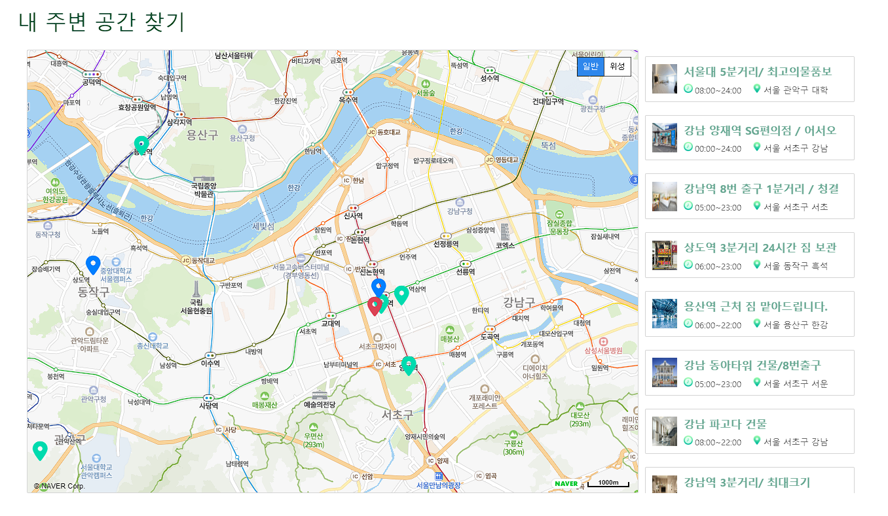
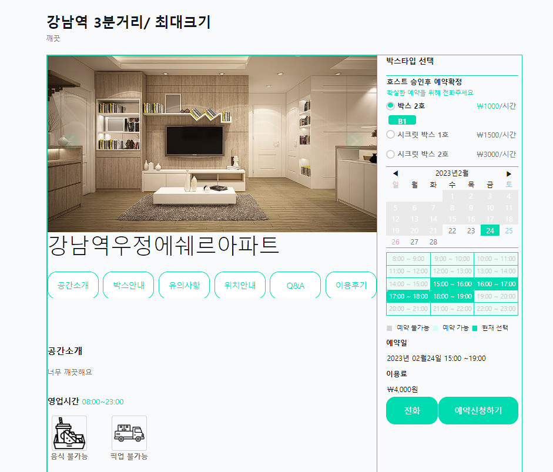
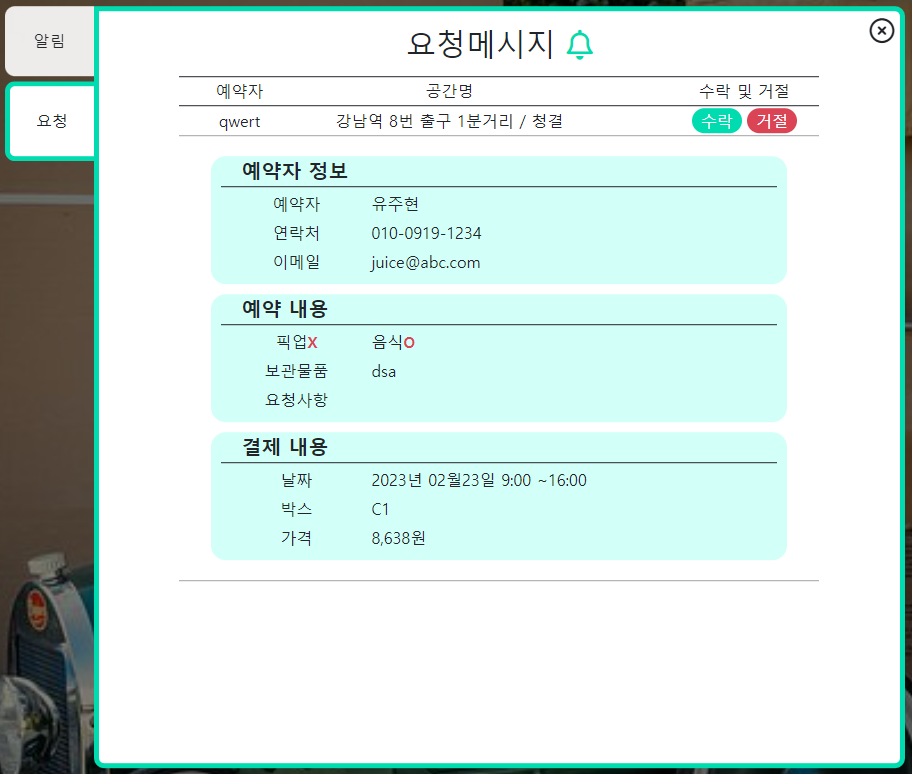

# Neighbor Cabinet 

## 프로젝트 개요
Spring Boot 기반의 웹 애플리케이션으로, **이웃 간 물품 보관 및 공간 공유 플랫폼**입니다.   
사용자는 남는 공간을 등록하고, 다른 사용자는 인근 공간을 검색해 **물품을 보관하고 실시간으로 예약/결제**할 수 있습니다.

## 사용 기술
| 분류 | 기술 |
|------|------|
| Language | Java 11 |
| Framework | Spring Boot 2.7.6 |
| ORM | MyBatis |
| Database | MySQL |
| View | JSP (JSTL 포함) |
| 보안 | Spring Security |
| 유틸리티 | Apache Commons Lang3, ZXing (QR) |
| 외부 API | Naver Map API |

## 주요 기능
- 회원가입 / 로그인 / 권한(관리자, 사용자) 분리
- 공간 등록 및 관리 (시간, 위치, 가격 등)
- 주변 공간 검색 (Naver 지도 API 활용)
- 예약 및 결제 기능
- QR 코드 생성/확인으로 물품 보관 인증
- 챗봇 기반 빠른 페이지 이동
- 실시간 예약 수락 / 거절 처리

## 프로젝트 구조

```
neighborCabinet/
├── src/
│ ├── main/
│ │ ├── java/
│ │ │ └── com/neighborCabinet/project/ # 핵심 비즈니스 로직
│ │ ├── resources/
│ │ │ ├── application.properties # 환경 설정
│ │ │ ├── mappers/ # MyBatis 매퍼 XML
│ │ │ └── static/ # 정적 리소스 (CSS, JS, 이미지)
│ │ └── webapp/
│ │ └── WEB-INF/
│ │ └── views/ # JSP 뷰 파일
│ └── test/ # 테스트 코드
├── uploads/ # 업로드된 파일 저장 폴더
├── pom.xml # Maven 설정 파일
└── ...
```

## 주요 화면 

### 주변 보관 공간 확인
사용자의 위치를 기반으로 지도에서 근처 보관소를 확인




### 공간 예약 및 결제
시간대 선택 → 실시간 예약 및 결제



### 실시간 거래 수락 / 거절
예약 요청에 대해 실시간 응답 가능



